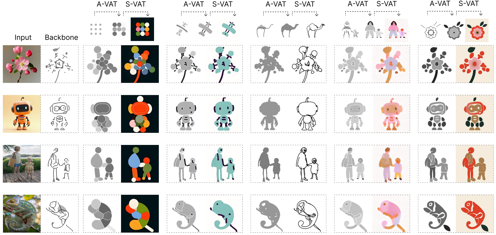
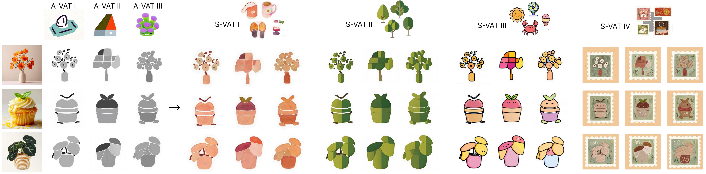

# Abstraction in Style: Beyond Texture and Color

Official code for the paper [Abstraction in Style: Beyond Texture and Color](https://arxiv.org/abs/2603.29924).

Project page: [https://chapai24.github.io/AiS_gh_pages/](https://chapai24.github.io/AiS_gh_pages/)

<p align="center">
  
</p>

AiS studies a part of style transfer that many methods miss: style is not only texture and color, but also abstraction of structure. Instead of forcing the target image to keep its original geometry, AiS separates the process into two stages:

- `A-VAT`: transforms the target into an abstraction proxy that follows the structural logic of the reference style.
- `S-VAT`: renders that proxy into the final stylized result with the appearance of the reference style.

This design makes structure and appearance controllable in a cleaner way, especially for illustrative and non-photorealistic styles.

## Installation

Environment setup commands are provided in [install_env.sh](/mnt/d/hyf_workspace/Abstraction_in_Style/install_env.sh).

```bash
conda create -n AiS python=3.10 -y
conda activate AiS
bash install_env.sh
```

## How It Works

AiS formulates stylized image generation as a two-stage Visual Analogy Transfer pipeline. First, `A-VAT` interprets the target image using the abstraction behavior seen in the reference exemplars and produces an abstraction proxy. Then, `S-VAT` turns that proxy into the final stylized output while matching the visual appearance of the chosen style.

<p align="center">
  
</p>

Within this shared VAT framework, `A-VAT` learns structural abstraction from analogy layouts, while `S-VAT` learns the mapping from proxy to final rendering. In practice, both stages are implemented with a diffusion transformer and lightweight LoRA adapters.

## Data Preparation

For each style, you only need to prepare:

```text
dataset/<style_name>/original/
```

Put each object cropped from the style images into this folder. Each object should be placed on a clean, centered background.

Example:

```text
dataset/Fluffy_Brush/original/
├── 1.jpg
├── 2.jpg
├── 3.jpg
└── ...
```

Then run:

```bash
python data_preparation/prepare_dataset.py <style_name>
```

This command automatically creates:

- `proxy_svg/`
- `proxy_svg2png/`
- `backbone/`
- `A-VAT_train_Data/`
- `S-VAT_train_Data/`

The weight folders below are created later by training, not by dataset preparation:

- `A-VAT_checkpoint/`
- `S-VAT_checkpoint/`

## Training

Edit the list of style folders near the top of [train_AiS.sh](/mnt/d/hyf_workspace/Abstraction_in_Style/train_AiS.sh), then run:

```bash
bash train_AiS.sh
```

The script trains both stages by default and saves weights to:

- `dataset/<style_name>/A-VAT_checkpoint/`
- `dataset/<style_name>/S-VAT_checkpoint/`

## Inference

Place test images in:

```text
test_assets/input_images/
```

Run the full two-stage pipeline:

```bash
python test_AiS.py --style <style_name> --stage all
```

Or run a single stage:

```bash
python test_AiS.py --style <style_name> --stage A-VAT
python test_AiS.py --style <style_name> --stage S-VAT
```

Outputs are saved to:

```text
test_assets/generated_images/
```

## Generated Examples

The generation process is illustrated in more detail below. For each target image, AiS first builds a style-agnostic backbone, then uses `A-VAT` to produce an abstraction proxy, and finally uses `S-VAT` to render the stylized output.

<p align="center">
  
</p>

A broad gallery of stylized results across multiple targets and reference styles is shown below. Each row uses one reference style, while each column corresponds to a different target image. This highlights that AiS can apply one style consistently to varied content.

<p align="center">
  
</p>

## Independent Control of Structure and Style

AiS can mix different structural abstractions with different rendering styles. With the same `S-VAT`, outputs can share texture and color while keeping different geometries from different `A-VAT` models.

<p align="center">
  
</p>

## Comparison with State-of-the-Art Methods

Existing methods often preserve the input structure too rigidly, which limits their ability to model abstract artistic styles. AiS is designed to capture both stylistic appearance and structural reinterpretation.

<p align="center">
  
</p>

## Citation

```bibtex
@misc{lu2026abstractionstyle,
  title={Abstraction in Style: Beyond Texture and Color},
  author={Min Lu and Yuanfeng He and Anthony Chen and Jianhuang He and Pu Wang and Daniel Cohen-Or and Hui Huang},
  year={2026},
  eprint={2603.29924},
  archivePrefix={arXiv},
  primaryClass={cs.CV},
  url={https://arxiv.org/abs/2603.29924},
}
```

## License

This repository is released under the license in [LICENSE](/mnt/d/hyf_workspace/Abstraction_in_Style/LICENSE).
