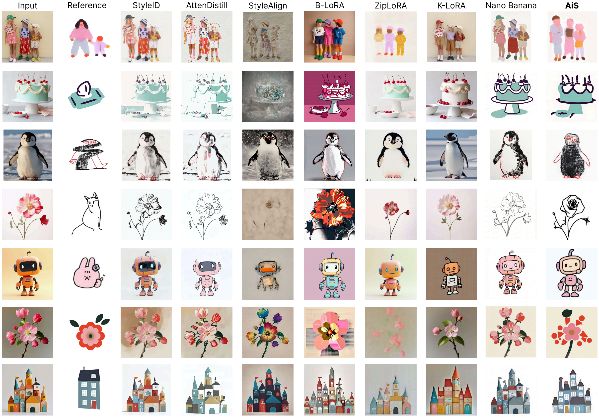
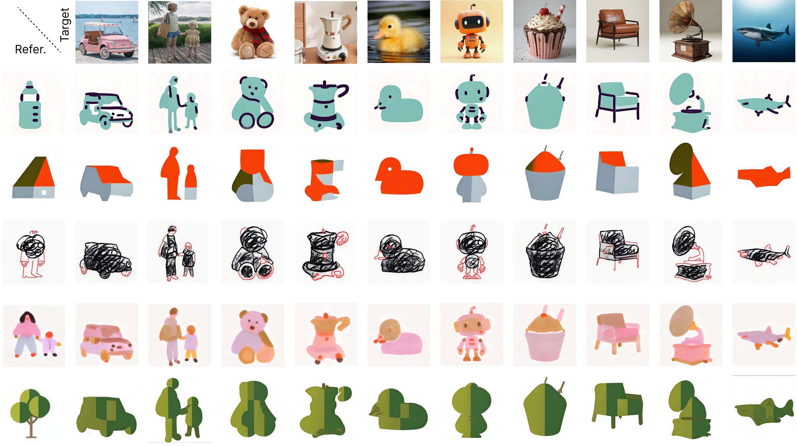

# Abstraction in Style: Beyond Texture and Color (SIGGRAPH 2026)
<div align="center">

### [Paper](https://arxiv.org/abs/2603.29924) | [Project Page](https://szuviz.github.io/abstraction-in-style/)

[Min Lu](https://deardeer.github.io/)<sup>1</sup> · Yuanfeng He<sup>1</sup> · [Anthony Chen](https://antonioo-c.github.io/)<sup>2</sup>· Jianhuang He<sup>1</sup>· Pu Wang<sup>1</sup> · [Daniel Cohen-Or](https://danielcohenor.com/)<sup>3</sup> · [Hui Huang](https://vcc.tech/~huihuang)<sup>1</sup>

<sup>1</sup>Shenzhen University · <sup>2</sup>Peking University · <sup>3</sup>Tel-Aviv University

</div>


<p align="center">
  
</p>

In this work, we emphasize the notion of **abstraction** in style transfer, especially for illustrative styles. Therefore a two-stage style transfer method is proposed, which is denoted as **Abstraction in Style (AiS)**: 

- **Stage I - Structural Abstraction**: transforms the target image into an abstraction proxy that follows the structural logic of the reference style.
- **Stage II - Visual Stylization**: renders the abstraction proxy into the final stylized result with the appearance of the reference style.

Our work currently targets at object-centered content images, and specifcially for illustrative and non-photorealistic styles. 


## How It Works


Both two stages are implemented as in-context learning problem in image inpainting, i.e., train a LoRA to learn and transfer the visual analogy (i.e., VAT). For stage I, the `Abstraction Visual Analogy Transfer (A-VAT)` LoRA learns the visual analogy of 'hidden backbone -> abstraction proxy' from reference exmaplars. For stage II, the `Stylization Visual Analogy Transfer (S-VAT)` learns the visual analogy of 'abstraction proxy -> final output' from reference examplars. In practice, both stages are implemented with a diffusion transformer (FLUX.1-Fill-dev) and lightweight LoRA adapters.

<p align="center">
  
</p>


## Installation

Environment setup commands are provided in [install_env.sh](/mnt/d/hyf_workspace/Abstraction_in_Style/install_env.sh).

```bash
conda create -n AiS python=3.10 -y
conda activate AiS
bash install_env.sh
```

## Inference 

Run the full two-stage pipeline:

```bash
python test_AiS.py --style <style_name> --stage all
# e.g., python test_AiS.py --style Fluffy_Brush --stage all
```

Or run a single stage:

```bash
python test_AiS.py --style <style_name> --stage A-VAT
python test_AiS.py --style <style_name> --stage S-VAT
```

Default input directories:

```text
--stage all    -> test_assets/input_images/
--stage A-VAT  -> test_assets/input_images/
--stage S-VAT  -> test_assets/generated_images/A-VAT_outputs/
```

You can override the default behavior with `--input-dir`.

Outputs are saved to:

```text
test_assets/generated_images/
├── input_img_vectorized/   # cached vectorized SVGs for test inputs
├── input_img_backbone/     # cached backbone images for test inputs
├── A-VAT_outputs/          # outputs generated by A-VAT
└── S-VAT_outputs/          # outputs generated by S-VAT
```

## Train a Style

### 1. Data Preparation

For each style, you need to prepare 5 to 10 examplar images and put them in below folder, with the `style_name' to specify the style. Each examplar image shall be put in a clean background, centered. 

```text
dataset/<style_name>/original/
```

Example:

```text
dataset/Fluffy_Brush/original/
├── 1.jpg
├── 2.jpg
├── 3.jpg
└── ...
```

Then run:

```bash
python data_preparation/prepare_dataset.py <style_name>
```

This command creates following folders and automatically generate the `hidden backbone -> abstraction proxy', 'abtraction proxy -> final output' dataset for training:

- `proxy_svg/`
- `proxy_svg2png/`
- `backbone/`
- `A-VAT_train_Data/`
- `S-VAT_train_Data/`

Here, the weight folders are created for later training. 

### 2. Training

Set the parameter 'STYLE_FOLDERS' to your style name in [train_AiS.sh](train_AiS.sh), then run:

```bash
bash train_AiS.sh 
```

The script will trains both stages by default and saves weights to:

- `dataset/<style_name>/A-VAT_checkpoint/`
- `dataset/<style_name>/S-VAT_checkpoint/`

## Comparison with State-of-the-Art Methods

Existing methods preserve the input structure too rigidly, which limits their ability to model abstract artistic styles. AiS is designed to capture both stylistic appearance and structural reinterpretation.

<p align="center">
  
</p>


## Generated Examples

A broad gallery of stylized results across multiple targets and reference styles is shown below. Each row uses one reference style, while each column corresponds to a different target image. 

<p align="center">
  
</p>


<p align="center">
  
</p>

## Mix-up Inference of A-VAT and S-VAT

Another advantage that AiS distangles abstration and style is to create new style by mixing up A-VAT and S-VAT from different styles. 


```bash
python test_AiS.py --style <style1> --stage A-VAT
python test_AiS.py --style <style2> --stage S-VAT
```

Below shows some results of mixing up `A-VAT` and `S-VAT`. 

<p align="center">
  
</p>


## Citation

```bibtex
@misc{lu2026abstractionstyle,
  title={Abstraction in Style},
  author={Min Lu and Yuanfeng He and Anthony Chen and Jianhuang He and Pu Wang and Daniel Cohen-Or and Hui Huang},
  year={2026},
  eprint={2603.29924},
  archivePrefix={arXiv},
  primaryClass={cs.CV},
  url={https://arxiv.org/abs/2603.29924},
}
```

## License

This repository is released under the license in [LICENSE](/mnt/d/hyf_workspace/Abstraction_in_Style/LICENSE).
